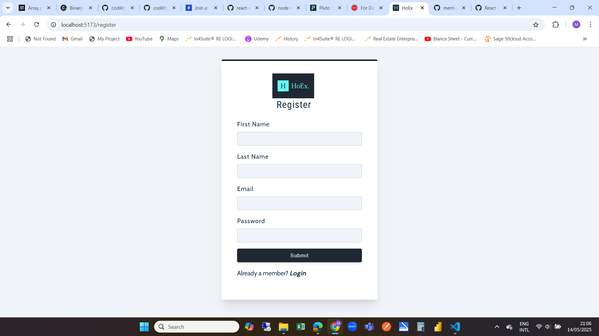
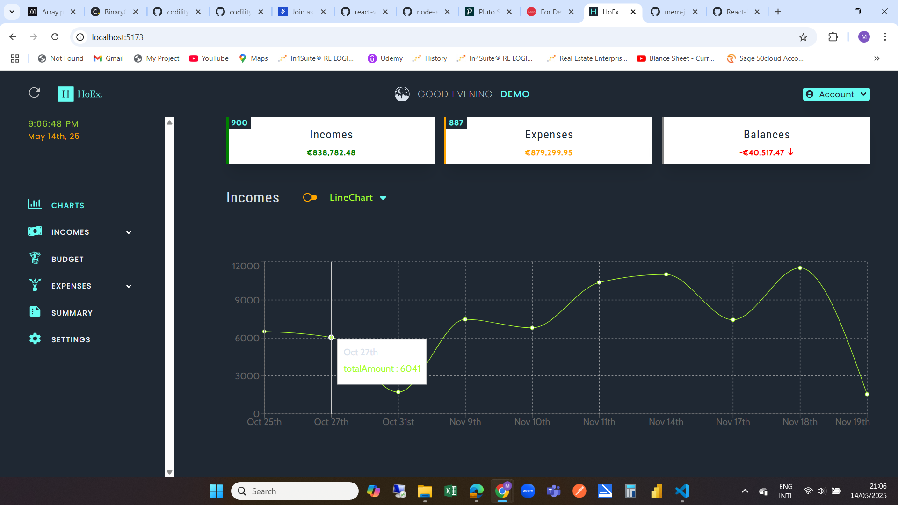
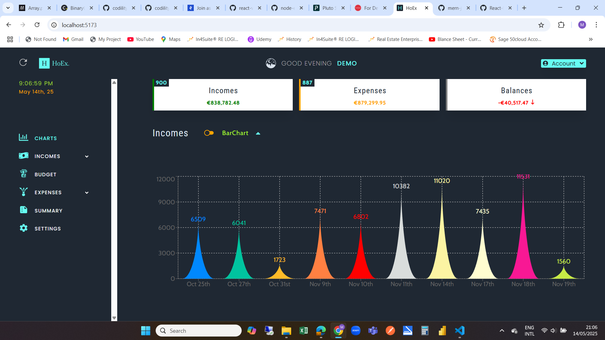
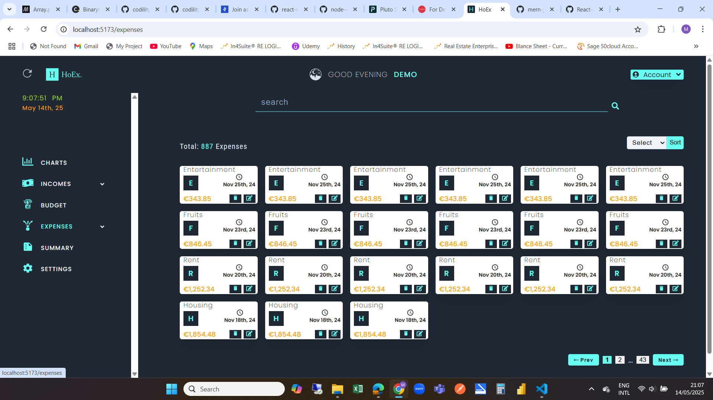
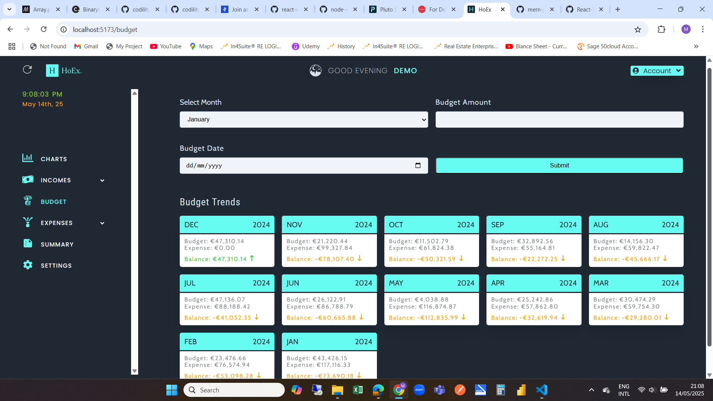
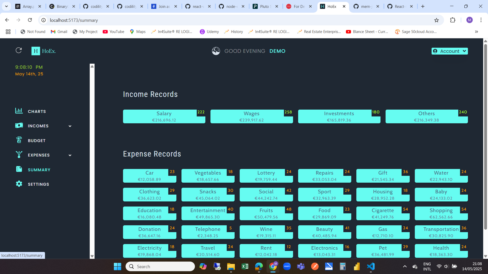

## Landing Page

## Register Page

## Login page

## Line-Chart Expense

## Bar-Chart Expense

## Line-Chart Income

## Bar-Chart Income

## Income Page

## Expense Page

## Expenses List

## Budget Page

## Summary Page

## Settings Page

